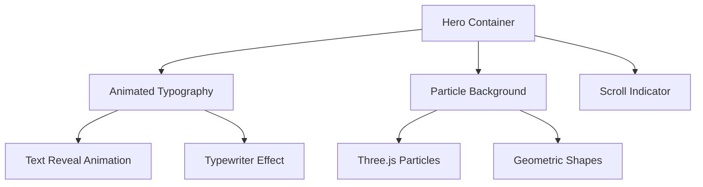
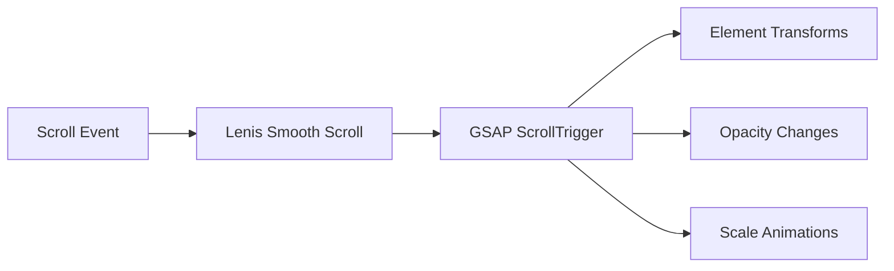
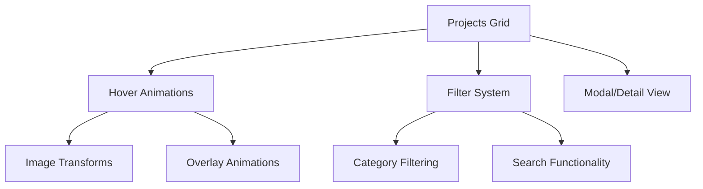
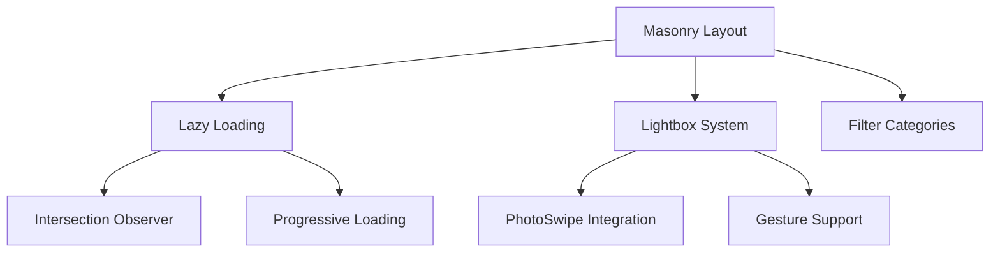
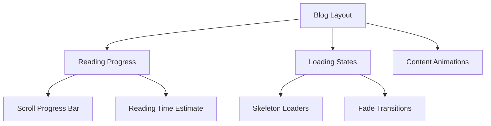

# Portfolio Website Architecture Plan

## 🎯 Project Overview

A comprehensive personal portfolio website focused on visual impact and stunning animations, featuring projects showcase, photography gallery, and blog content with modern interactive elements.

## 🛠️ Technology Stack

### Core Framework

- **Next.js 14** with App Router for SSG/SSR capabilities
- **TypeScript** for type safety and better development experience
- **React 18** with concurrent features for smooth animations

### Styling & Animation

- **Tailwind CSS** for utility-first styling and rapid development
- **Framer Motion** for React-based animations and gestures
- **GSAP** for complex timeline animations and scroll-triggered effects
- **Lenis** for smooth scrolling experience

### Additional Libraries

- **React Hook Form** for form handling with validation
- **Zod** for schema validation
- **Next-themes** for dark/light mode implementation
- **React-intersection-observer** for scroll-triggered animations
- **Photoswipe** for lightbox gallery functionality
- **React-masonry-css** for masonry layout

## 🏗️ Project Structure

```
portfolio/
├── src/
│   ├── app/                    # Next.js App Router
│   │   ├── globals.css
│   │   ├── layout.tsx
│   │   ├── page.tsx
│   │   ├── projects/
│   │   ├── photography/
│   │   ├── blog/
│   │   └── contact/
│   ├── components/             # Reusable components
│   │   ├── ui/                # Base UI components
│   │   ├── animations/        # Animation components
│   │   ├── layout/           # Layout components
│   │   └── sections/         # Page sections
│   ├── hooks/                 # Custom React hooks
│   ├── lib/                   # Utilities and configurations
│   ├── types/                 # TypeScript type definitions
│   └── data/                  # Static data and content
├── public/                    # Static assets
│   ├── images/
│   ├── icons/
│   └── animations/
└── docs/                      # Documentation
```

## 🎨 Design System

### Animation Principles

1. **Performance First**: 60fps animations using transform and opacity
2. **Meaningful Motion**: Animations that enhance user experience
3. **Progressive Enhancement**: Graceful degradation for low-end devices
4. **Accessibility**: Respect `prefers-reduced-motion` settings

### Color Palette

- **Primary**: Dynamic gradient system
- **Secondary**: Complementary accent colors
- **Neutral**: Sophisticated grayscale palette
- **Theme Support**: Seamless dark/light mode transitions

### Typography

- **Headings**: Modern sans-serif with animated reveals
- **Body**: Readable serif/sans-serif combination
- **Code**: Monospace for technical content

## 🚀 Key Features & Implementation

### 1. Hero Section



**Technical Implementation:**

- GSAP timeline for text animations
- Three.js or CSS-based particle system
- Intersection Observer for scroll triggers
- Responsive typography scaling

### 2. Parallax Scrolling System



**Technical Implementation:**

- Lenis for smooth scrolling
- GSAP ScrollTrigger for parallax effects
- Transform3d for hardware acceleration
- Throttled scroll events for performance

### 3. Projects Showcase



**Technical Implementation:**

- Framer Motion for hover states
- Dynamic image loading with Next.js Image
- Staggered animations for grid items
- Modal system with focus management

### 4. Photography Gallery



**Technical Implementation:**

- React-masonry-css for responsive layout
- PhotoSwipe for lightbox functionality
- Lazy loading with blur-up effect
- Touch gestures for mobile

### 5. Blog Section



**Technical Implementation:**

- MDX for rich content
- Reading progress calculation
- Animated skeleton loaders
- Smooth page transitions

## 🎭 Animation Specifications

### Micro-Interactions

1. **Button Hovers**: Scale + shadow + color transitions
2. **Link Hovers**: Underline animations with easing
3. **Card Hovers**: Lift effect with subtle shadows
4. **Form Focus**: Border glow and label animations

### Scroll Animations

1. **Fade In Up**: Elements enter from bottom with opacity
2. **Stagger**: Sequential animation delays for lists
3. **Parallax**: Different scroll speeds for depth
4. **Reveal**: Text/image reveals with masks

### Page Transitions

1. **Route Changes**: Smooth fade/slide transitions
2. **Modal Animations**: Scale in/out with backdrop
3. **Theme Toggle**: Smooth color transitions
4. **Loading States**: Elegant skeleton animations

## 📱 Responsive Design Strategy

### Breakpoints

- **Mobile**: 320px - 768px
- **Tablet**: 768px - 1024px
- **Desktop**: 1024px - 1440px
- **Large**: 1440px+

### Animation Adaptations

- Reduced motion on mobile for performance
- Touch-friendly interactions
- Simplified animations for low-end devices
- Progressive enhancement approach

## ⚡ Performance Optimization

### Image Optimization

- Next.js Image component with WebP/AVIF
- Lazy loading with intersection observer
- Blur placeholder for smooth loading
- Responsive image sizing

### Animation Performance

- Transform and opacity only for 60fps
- Will-change property management
- Animation cleanup on unmount
- Reduced motion preferences

### Code Splitting

- Route-based code splitting
- Dynamic imports for heavy components
- Tree shaking for unused code
- Bundle analysis and optimization

## 🔧 Development Workflow

### Phase 1: Foundation (Days 1-2)

- Project setup and configuration
- Basic layout and navigation
- Theme system implementation

### Phase 2: Core Sections (Days 3-5)

- Hero section with animations
- Projects showcase
- Photography gallery

### Phase 3: Content & Interactions (Days 6-7)

- Blog implementation
- Contact form
- Micro-interactions

### Phase 4: Polish & Optimization (Days 8-9)

- Performance optimization
- Cross-browser testing
- Animation fine-tuning

### Phase 5: Deployment (Day 10)

- Production build optimization
- Deployment configuration
- Final testing

## 🧪 Testing Strategy

### Animation Testing

- 60fps performance validation
- Cross-browser compatibility
- Mobile device testing
- Accessibility compliance

### User Experience Testing

- Navigation flow testing
- Form validation testing
- Responsive design validation
- Loading performance testing

## 🚀 Deployment & Hosting

### Recommended Platform

- **Vercel** for optimal Next.js performance
- **Cloudinary** for image optimization
- **GitHub** for version control
- **Analytics** integration for insights

This architecture ensures a visually stunning, highly interactive portfolio that prioritizes animations and user engagement while maintaining excellent performance and accessibility standards.
