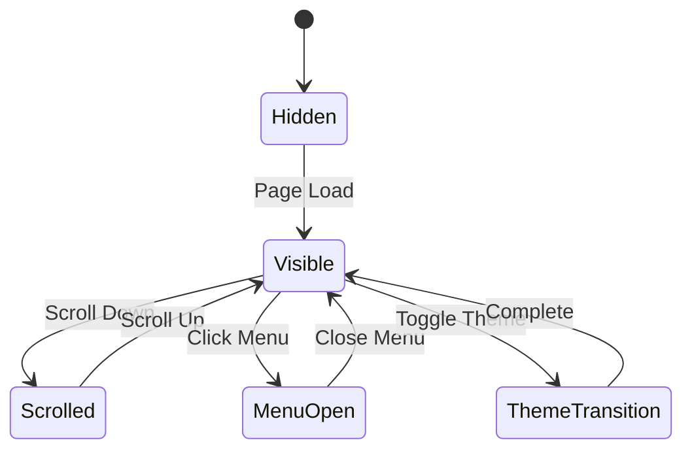

# Navigation & Micro-Interactions Detailed Specifications

## 🧭 Navigation System Architecture

### Navigation States & Transitions



## 🎨 Desktop Navigation Component

### 1. Main Navigation Bar

```typescript
interface NavigationBarProps {
  variant: "transparent" | "blur" | "solid";
  position: "fixed" | "sticky";
  hideOnScroll: boolean;
  showProgress: boolean;
}
```

**Animation Timeline (Total: 1200ms)**

```javascript
// Navigation entrance animation
const navEntranceTimeline = gsap.timeline({ paused: true });

navEntranceTimeline
  .fromTo(
    ".nav-container",
    { y: -100, opacity: 0 },
    { y: 0, opacity: 1, duration: 0.6, ease: "power2.out" }
  )
  .fromTo(
    ".nav-logo",
    { scale: 0, rotation: -180 },
    { scale: 1, rotation: 0, duration: 0.4, ease: "back.out(1.7)" },
    "-=0.3"
  )
  .fromTo(
    ".nav-links li",
    { y: -30, opacity: 0 },
    { y: 0, opacity: 1, duration: 0.3, stagger: 0.1, ease: "power2.out" },
    "-=0.2"
  )
  .fromTo(
    ".nav-cta",
    { scale: 0, opacity: 0 },
    { scale: 1, opacity: 1, duration: 0.3, ease: "back.out(1.7)" },
    "-=0.1"
  );
```

### 2. Logo Animation Specifications

```typescript
interface LogoAnimationProps {
  variant: "text" | "icon" | "combined";
  hoverEffect: "glow" | "morph" | "rotate" | "pulse";
  clickEffect: "bounce" | "flash" | "ripple";
}
```

**Logo Hover Animation (400ms)**

```css
.logo {
  transition: all 0.4s cubic-bezier(0.4, 0, 0.2, 1);
  position: relative;
  overflow: hidden;
}

.logo::before {
  content: "";
  position: absolute;
  top: 0;
  left: -100%;
  width: 100%;
  height: 100%;
  background: linear-gradient(
    90deg,
    transparent,
    rgba(255, 255, 255, 0.2),
    transparent
  );
  transition: left 0.6s;
}

.logo:hover::before {
  left: 100%;
}

.logo:hover {
  transform: scale(1.05) rotate(2deg);
  filter: drop-shadow(0 0 20px rgba(59, 130, 246, 0.5));
}
```

**Logo Click Animation**

```javascript
const logoClickAnimation = () => {
  gsap
    .timeline()
    .to(".logo", { scale: 0.95, duration: 0.1 })
    .to(".logo", { scale: 1.1, duration: 0.2, ease: "back.out(1.7)" })
    .to(".logo", { scale: 1, duration: 0.2, ease: "power2.out" });
};
```

### 3. Navigation Links Micro-Interactions

**Link Hover Effects (300ms each)**

```typescript
interface NavLinkProps {
  text: string;
  href: string;
  isActive: boolean;
  hoverEffect: "underline" | "background" | "glow" | "morph";
}
```

**Underline Animation**

```css
.nav-link {
  position: relative;
  overflow: hidden;
  transition: color 0.3s ease;
}

.nav-link::after {
  content: "";
  position: absolute;
  bottom: -2px;
  left: 0;
  width: 0;
  height: 2px;
  background: linear-gradient(90deg, #3b82f6, #8b5cf6);
  transition: width 0.3s cubic-bezier(0.4, 0, 0.2, 1);
}

.nav-link:hover::after {
  width: 100%;
}

.nav-link:hover {
  color: #3b82f6;
  text-shadow: 0 0 8px rgba(59, 130, 246, 0.3);
}
```

**Background Glow Effect**

```css
.nav-link-glow {
  position: relative;
  padding: 8px 16px;
  border-radius: 8px;
  transition: all 0.3s ease;
}

.nav-link-glow::before {
  content: "";
  position: absolute;
  inset: 0;
  border-radius: 8px;
  background: linear-gradient(45deg, #3b82f6, #8b5cf6);
  opacity: 0;
  transition: opacity 0.3s ease;
  z-index: -1;
}

.nav-link-glow:hover::before {
  opacity: 0.1;
}

.nav-link-glow:hover {
  transform: translateY(-2px);
  box-shadow: 0 8px 25px rgba(59, 130, 246, 0.2);
}
```

### 4. Scroll-Based Navigation Behavior

**Hide/Show Animation (500ms)**

```javascript
const navScrollBehavior = () => {
  let lastScrollY = window.scrollY;
  let ticking = false;

  const updateNav = () => {
    const currentScrollY = window.scrollY;
    const scrollingDown = currentScrollY > lastScrollY;
    const scrollThreshold = 100;

    if (currentScrollY > scrollThreshold) {
      if (scrollingDown) {
        // Hide navigation
        gsap.to(".nav-container", {
          y: -100,
          opacity: 0.8,
          backdropFilter: "blur(10px)",
          duration: 0.5,
          ease: "power2.out",
        });
      } else {
        // Show navigation
        gsap.to(".nav-container", {
          y: 0,
          opacity: 1,
          backdropFilter: "blur(20px)",
          duration: 0.5,
          ease: "power2.out",
        });
      }
    }

    lastScrollY = currentScrollY;
    ticking = false;
  };

  const requestTick = () => {
    if (!ticking) {
      requestAnimationFrame(updateNav);
      ticking = true;
    }
  };

  window.addEventListener("scroll", requestTick);
};
```

## 📱 Mobile Navigation System

### 1. Hamburger Menu Animation

```typescript
interface HamburgerMenuProps {
  isOpen: boolean;
  variant: "lines" | "dots" | "arrow";
  animationDuration: number;
}
```

**Hamburger to X Transformation (400ms)**

```css
.hamburger {
  width: 24px;
  height: 24px;
  position: relative;
  cursor: pointer;
}

.hamburger-line {
  position: absolute;
  width: 100%;
  height: 2px;
  background: currentColor;
  transition: all 0.4s cubic-bezier(0.4, 0, 0.2, 1);
  transform-origin: center;
}

.hamburger-line:nth-child(1) {
  top: 6px;
}

.hamburger-line:nth-child(2) {
  top: 11px;
}

.hamburger-line:nth-child(3) {
  top: 16px;
}

/* Open state */
.hamburger.open .hamburger-line:nth-child(1) {
  transform: rotate(45deg) translate(5px, 5px);
}

.hamburger.open .hamburger-line:nth-child(2) {
  opacity: 0;
  transform: scale(0);
}

.hamburger.open .hamburger-line:nth-child(3) {
  transform: rotate(-45deg) translate(7px, -6px);
}
```

### 2. Mobile Menu Overlay

```typescript
interface MobileMenuProps {
  isOpen: boolean;
  animationType: "slide" | "fade" | "scale" | "reveal";
  backdropBlur: boolean;
  closeOnLinkClick: boolean;
}
```

**Slide-in Animation (600ms)**

```javascript
const mobileMenuAnimation = {
  open: {
    // Backdrop
    backdrop: {
      opacity: [0, 1],
      backdropFilter: ["blur(0px)", "blur(10px)"],
      duration: 0.3,
    },
    // Menu panel
    panel: {
      x: ["100%", "0%"],
      duration: 0.6,
      ease: "power2.out",
    },
    // Menu items
    items: {
      y: [50, 0],
      opacity: [0, 1],
      stagger: 0.1,
      delay: 0.2,
      duration: 0.4,
    },
  },
  close: {
    items: {
      y: [0, -30],
      opacity: [1, 0],
      stagger: 0.05,
      duration: 0.2,
    },
    panel: {
      x: ["0%", "100%"],
      duration: 0.4,
      delay: 0.1,
      ease: "power2.in",
    },
    backdrop: {
      opacity: [1, 0],
      backdropFilter: ["blur(10px)", "blur(0px)"],
      duration: 0.3,
      delay: 0.2,
    },
  },
};
```

### 3. Mobile Menu Items

```css
.mobile-menu-item {
  padding: 16px 24px;
  border-bottom: 1px solid rgba(255, 255, 255, 0.1);
  transition: all 0.3s ease;
  position: relative;
  overflow: hidden;
}

.mobile-menu-item::before {
  content: "";
  position: absolute;
  left: -100%;
  top: 0;
  width: 100%;
  height: 100%;
  background: linear-gradient(
    90deg,
    transparent,
    rgba(59, 130, 246, 0.1),
    transparent
  );
  transition: left 0.5s ease;
}

.mobile-menu-item:hover::before {
  left: 100%;
}

.mobile-menu-item:active {
  transform: scale(0.98);
  background: rgba(59, 130, 246, 0.05);
}
```

## 🎯 Button Micro-Interactions

### 1. Primary CTA Button

```typescript
interface CTAButtonProps {
  variant: "primary" | "secondary" | "ghost";
  size: "sm" | "md" | "lg";
  loading: boolean;
  disabled: boolean;
  rippleEffect: boolean;
}
```

**Button Hover Animation (300ms)**

```css
.cta-button {
  position: relative;
  padding: 12px 24px;
  border-radius: 8px;
  background: linear-gradient(135deg, #3b82f6, #8b5cf6);
  color: white;
  border: none;
  cursor: pointer;
  overflow: hidden;
  transition: all 0.3s cubic-bezier(0.4, 0, 0.2, 1);
  transform-style: preserve-3d;
}

.cta-button::before {
  content: "";
  position: absolute;
  inset: 0;
  background: linear-gradient(135deg, #1d4ed8, #7c3aed);
  opacity: 0;
  transition: opacity 0.3s ease;
}

.cta-button:hover {
  transform: translateY(-2px) scale(1.02);
  box-shadow: 0 10px 25px rgba(59, 130, 246, 0.3), 0 0 0 1px rgba(255, 255, 255, 0.1);
}

.cta-button:hover::before {
  opacity: 1;
}

.cta-button:active {
  transform: translateY(0) scale(0.98);
  transition-duration: 0.1s;
}
```

**Ripple Effect**

```javascript
const createRipple = (event, button) => {
  const rect = button.getBoundingClientRect();
  const size = Math.max(rect.width, rect.height);
  const x = event.clientX - rect.left - size / 2;
  const y = event.clientY - rect.top - size / 2;

  const ripple = document.createElement("span");
  ripple.className = "ripple";
  ripple.style.cssText = `
    position: absolute;
    width: ${size}px;
    height: ${size}px;
    left: ${x}px;
    top: ${y}px;
    background: rgba(255, 255, 255, 0.3);
    border-radius: 50%;
    transform: scale(0);
    animation: ripple-animation 0.6s ease-out;
    pointer-events: none;
  `;

  button.appendChild(ripple);

  setTimeout(() => ripple.remove(), 600);
};

// CSS for ripple animation
const rippleCSS = `
@keyframes ripple-animation {
  to {
    transform: scale(2);
    opacity: 0;
  }
}
`;
```

### 2. Loading Button States

```javascript
const buttonLoadingAnimation = {
  start: () => {
    gsap
      .timeline()
      .to(".button-text", { opacity: 0, duration: 0.2 })
      .to(
        ".button-spinner",
        { opacity: 1, rotation: 360, duration: 0.3 },
        "-=0.1"
      )
      .to(".button-spinner", {
        rotation: "+=360",
        duration: 1,
        repeat: -1,
        ease: "none",
      });
  },
  complete: () => {
    gsap
      .timeline()
      .to(".button-spinner", { opacity: 0, rotation: 0, duration: 0.2 })
      .to(".button-text", { opacity: 1, duration: 0.2 })
      .to(".button", { scale: 1.05, duration: 0.1 })
      .to(".button", { scale: 1, duration: 0.2, ease: "back.out(1.7)" });
  },
};
```

## 🎨 Theme Toggle Micro-Interactions

### 1. Theme Switch Component

```typescript
interface ThemeSwitchProps {
  variant: "switch" | "button" | "icon";
  showLabel: boolean;
  animationDuration: number;
  morphIcons: boolean;
}
```

**Sun to Moon Transformation (500ms)**

```css
.theme-toggle {
  position: relative;
  width: 48px;
  height: 48px;
  border-radius: 50%;
  border: none;
  background: transparent;
  cursor: pointer;
  transition: all 0.3s ease;
}

.theme-icon {
  position: absolute;
  inset: 0;
  display: flex;
  align-items: center;
  justify-content: center;
  transition: all 0.5s cubic-bezier(0.4, 0, 0.2, 1);
}

.sun-icon {
  transform: rotate(0deg) scale(1);
  opacity: 1;
}

.moon-icon {
  transform: rotate(180deg) scale(0);
  opacity: 0;
}

/* Dark mode active */
.dark .sun-icon {
  transform: rotate(-180deg) scale(0);
  opacity: 0;
}

.dark .moon-icon {
  transform: rotate(0deg) scale(1);
  opacity: 1;
}

.theme-toggle:hover {
  background: rgba(59, 130, 246, 0.1);
  transform: scale(1.1);
}
```

**Theme Transition Animation**

```javascript
const themeTransition = (isDark) => {
  // Create transition overlay
  const overlay = document.createElement("div");
  overlay.className = "theme-transition-overlay";
  overlay.style.cssText = `
    position: fixed;
    inset: 0;
    background: ${isDark ? "#0f172a" : "#ffffff"};
    z-index: 9999;
    pointer-events: none;
  `;

  document.body.appendChild(overlay);

  // Animate transition
  gsap
    .timeline()
    .fromTo(
      overlay,
      { clipPath: "circle(0% at 50% 50%)" },
      { clipPath: "circle(100% at 50% 50%)", duration: 0.6, ease: "power2.out" }
    )
    .call(
      () => {
        // Apply theme change
        document.documentElement.classList.toggle("dark", isDark);
      },
      [],
      0.3
    )
    .to(overlay, { opacity: 0, duration: 0.3, delay: 0.2 })
    .call(() => overlay.remove());
};
```

## 🎪 Advanced Micro-Interactions

### 1. Magnetic Button Effect

```javascript
const magneticEffect = (button) => {
  const handleMouseMove = (e) => {
    const rect = button.getBoundingClientRect();
    const centerX = rect.left + rect.width / 2;
    const centerY = rect.top + rect.height / 2;
    const deltaX = (e.clientX - centerX) * 0.2;
    const deltaY = (e.clientY - centerY) * 0.2;

    gsap.to(button, {
      x: deltaX,
      y: deltaY,
      duration: 0.3,
      ease: "power2.out",
    });
  };

  const handleMouseLeave = () => {
    gsap.to(button, {
      x: 0,
      y: 0,
      duration: 0.5,
      ease: "elastic.out(1, 0.3)",
    });
  };

  button.addEventListener("mousemove", handleMouseMove);
  button.addEventListener("mouseleave", handleMouseLeave);
};
```

### 2. Cursor Follow Effect

```javascript
const cursorFollowEffect = () => {
  const cursor = document.createElement("div");
  cursor.className = "custom-cursor";
  cursor.style.cssText = `
    position: fixed;
    width: 20px;
    height: 20px;
    background: rgba(59, 130, 246, 0.5);
    border-radius: 50%;
    pointer-events: none;
    z-index: 9999;
    transition: transform 0.1s ease;
  `;

  document.body.appendChild(cursor);

  document.addEventListener("mousemove", (e) => {
    gsap.to(cursor, {
      x: e.clientX - 10,
      y: e.clientY - 10,
      duration: 0.1,
    });
  });

  // Hover effects
  document.querySelectorAll("a, button").forEach((el) => {
    el.addEventListener("mouseenter", () => {
      gsap.to(cursor, { scale: 2, opacity: 0.3, duration: 0.2 });
    });

    el.addEventListener("mouseleave", () => {
      gsap.to(cursor, { scale: 1, opacity: 0.5, duration: 0.2 });
    });
  });
};
```

### 3. Scroll Progress Indicator

```javascript
const scrollProgressIndicator = () => {
  const progress = document.createElement("div");
  progress.className = "scroll-progress";
  progress.style.cssText = `
    position: fixed;
    top: 0;
    left: 0;
    width: 0%;
    height: 3px;
    background: linear-gradient(90deg, #3b82f6, #8b5cf6);
    z-index: 1000;
    transition: width 0.1s ease;
  `;

  document.body.appendChild(progress);

  const updateProgress = () => {
    const scrolled = window.scrollY;
    const maxScroll =
      document.documentElement.scrollHeight - window.innerHeight;
    const percentage = (scrolled / maxScroll) * 100;

    gsap.to(progress, {
      width: `${percentage}%`,
      duration: 0.1,
    });
  };

  window.addEventListener("scroll", updateProgress);
};
```

## 📱 Touch Gesture Interactions

### 1. Swipe Gestures

```javascript
const swipeGestures = (element) => {
  let startX, startY, distX, distY;
  const threshold = 50;

  element.addEventListener("touchstart", (e) => {
    startX = e.touches[0].clientX;
    startY = e.touches[0].clientY;
  });

  element.addEventListener("touchmove", (e) => {
    e.preventDefault();
    distX = e.touches[0].clientX - startX;
    distY = e.touches[0].clientY - startY;

    // Visual feedback during swipe
    gsap.to(element, {
      x: distX * 0.3,
      rotation: distX * 0.1,
      duration: 0.1,
    });
  });

  element.addEventListener("touchend", () => {
    if (Math.abs(distX) > threshold) {
      // Trigger swipe action
      const direction = distX > 0 ? "right" : "left";
      handleSwipe(direction);
    }

    // Reset position
    gsap.to(element, {
      x: 0,
      rotation: 0,
      duration: 0.3,
      ease: "back.out(1.7)",
    });
  });
};
```

### 2. Pull-to-Refresh

```javascript
const pullToRefresh = (container) => {
  let startY,
    currentY,
    pulling = false;
  const threshold = 80;

  const refreshIndicator = document.createElement("div");
  refreshIndicator.className = "pull-refresh-indicator";
  refreshIndicator.innerHTML = "↓ Pull to refresh";
  container.prepend(refreshIndicator);

  container.addEventListener("touchstart", (e) => {
    if (container.scrollTop === 0) {
      startY = e.touches[0].clientY;
      pulling = true;
    }
  });

  container.addEventListener("touchmove", (e) => {
    if (!pulling) return;

    currentY = e.touches[0].clientY;
    const pullDistance = Math.max(0, currentY - startY);

    if (pullDistance > 0) {
      e.preventDefault();

      gsap.to(refreshIndicator, {
        y: pullDistance,
        rotation: pullDistance * 2,
        opacity: Math.min(1, pullDistance / threshold),
        duration: 0.1,
      });

      if (pullDistance > threshold) {
        refreshIndicator.innerHTML = "↑ Release to refresh";
        refreshIndicator.style.color = "#10b981";
      }
    }
  });

  container.addEventListener("touchend", () => {
    if (pulling && currentY - startY > threshold) {
      // Trigger refresh
      triggerRefresh();
    }

    gsap.to(refreshIndicator, {
      y: 0,
      rotation: 0,
      opacity: 0,
      duration: 0.3,
    });

    pulling = false;
  });
};
```

This comprehensive specification provides detailed implementation guidance for creating stunning navigation and micro-interactions that will make your portfolio website truly exceptional and engaging.
