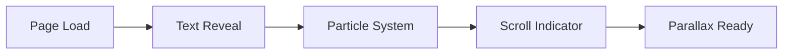
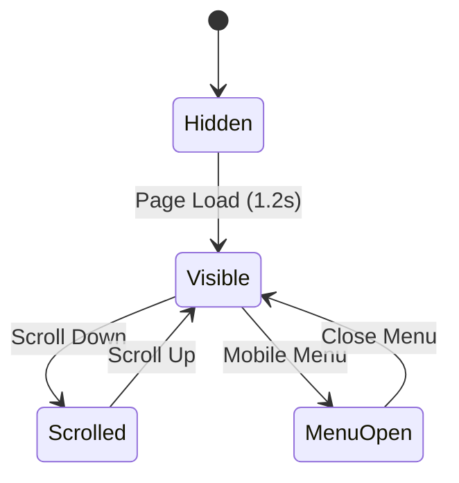
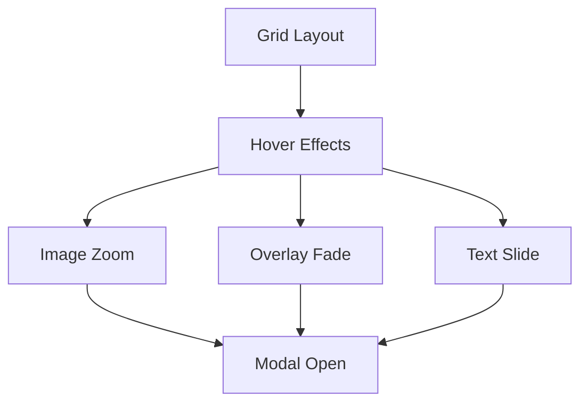
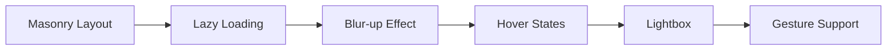

# Portfolio Website - Complete Architecture Summary

## 🎯 Project Overview

**Vision**: Create a visually stunning, highly interactive portfolio website that showcases projects, photography, and blog content with cutting-edge animations and modern web technologies.

**Focus**: Visual impact and stunning interactions with 60fps performance across all devices.

## 📋 Complete Documentation Structure

### 1. **ARCHITECTURE.md** - Core Technical Foundation

- **Technology Stack**: Next.js 14, TypeScript, Tailwind CSS, Framer Motion, GSAP
- **Project Structure**: Organized component hierarchy and file organization
- **Design System**: Color palettes, typography, animation principles
- **Key Features**: Hero section, parallax scrolling, project showcase, photography gallery, blog system

### 2. **COMPONENT_SPECIFICATIONS.md** - Detailed Component Blueprints

- **Animation Components**: AnimatedText, ScrollProgress, ParticleBackground
- **Layout Components**: AnimatedNavbar, MobileMenu, ProjectGrid, MasonryGallery
- **Interactive Elements**: SkillBars, ContactForm, FloatingActionButton, ThemeToggle
- **Performance Considerations**: Memory management, animation cleanup, reduced motion support

### 3. **IMPLEMENTATION_GUIDE.md** - Code Patterns & Configurations

- **Package Dependencies**: Complete package.json with all required libraries
- **Configuration Files**: Next.js, Tailwind, TypeScript configurations
- **Custom Hooks**: useGSAP, useIntersectionObserver, useParallax
- **Utility Functions**: Animation presets, performance optimizations, throttling/debouncing

### 4. **NAVIGATION_MICROINTERACTIONS_SPEC.md** - Detailed Navigation System

- **Desktop Navigation**: Logo animations, link hover effects, scroll behavior
- **Mobile Navigation**: Hamburger menu, overlay animations, touch gestures
- **Button Interactions**: CTA buttons, loading states, ripple effects, magnetic effects
- **Theme System**: Sun/moon transformation, smooth theme transitions
- **Advanced Features**: Cursor follow, scroll progress, pull-to-refresh

### 5. **PROJECT_ROADMAP.md** - Development Timeline & Strategy

- **Development Phases**: 10-day structured timeline with clear milestones
- **Architecture Diagrams**: Visual representation of system components
- **Performance Targets**: Core Web Vitals, animation performance metrics
- **Testing Strategy**: Animation testing, cross-browser compatibility, accessibility

## 🎨 Key Animation Features

### Hero Section Animations



**Specifications:**

- **Dynamic Typography**: Staggered character animations with typewriter effects
- **Particle Background**: Interactive floating particles with mouse attraction
- **Scroll Indicators**: Animated bounce effects with fade-out on scroll
- **Performance**: Hardware-accelerated transforms, 60fps target

### Navigation System



**Specifications:**

- **Desktop**: Logo morphing, link underline animations, scroll-based hide/show
- **Mobile**: Hamburger to X transformation, slide-in menu with staggered items
- **Micro-interactions**: Magnetic buttons, ripple effects, cursor following
- **Theme Toggle**: Sun/moon transformation with smooth color transitions

### Project Showcase



**Specifications:**

- **Grid Animations**: Staggered entrance with intersection observer
- **Hover Effects**: Scale, shadow, overlay with 300ms timing
- **Modal System**: Scale-in animation with backdrop blur
- **Filter System**: Smooth layout transitions with FLIP technique

### Photography Gallery



**Specifications:**

- **Masonry Layout**: Responsive columns with smooth repositioning
- **Lightbox**: PhotoSwipe integration with zoom transitions
- **Loading**: Progressive image loading with blur placeholders
- **Touch Support**: Swipe navigation, pinch-to-zoom, double-tap

## 🛠️ Technical Implementation Stack

### Core Technologies

| Technology    | Version | Purpose                              |
| ------------- | ------- | ------------------------------------ |
| Next.js       | 14.0+   | React framework with App Router      |
| TypeScript    | 5.0+    | Type safety and developer experience |
| Tailwind CSS  | 3.3+    | Utility-first styling                |
| Framer Motion | 10.16+  | React-based animations               |
| GSAP          | 3.12+   | Advanced timeline animations         |
| Lenis         | 1.0+    | Smooth scrolling                     |

### Animation Libraries

| Library       | Use Case                               | Performance            |
| ------------- | -------------------------------------- | ---------------------- |
| Framer Motion | Component animations, page transitions | Optimized for React    |
| GSAP          | Complex timelines, scroll triggers     | Hardware accelerated   |
| CSS3          | Micro-interactions, hover effects      | Native browser support |
| Lenis         | Smooth scrolling experience            | 60fps scrolling        |

### Performance Optimizations

| Technique          | Implementation            | Benefit              |
| ------------------ | ------------------------- | -------------------- |
| Lazy Loading       | Intersection Observer API | Reduced initial load |
| Code Splitting     | Dynamic imports           | Smaller bundles      |
| Image Optimization | Next.js Image component   | WebP/AVIF formats    |
| Animation Cleanup  | useEffect cleanup         | Memory management    |

## 🎯 Development Phases

### Phase 1: Foundation (Days 1-3)

- [x] **Project Setup**: Next.js, TypeScript, dependencies
- [x] **Configuration**: Tailwind, animation libraries
- [x] **Layout Structure**: Basic routing and navigation
- [x] **Theme System**: Dark/light mode implementation

### Phase 2: Visual Impact (Days 4-6)

- [x] **Hero Section**: Dynamic typography and particles
- [x] **Parallax System**: Smooth scroll-triggered animations
- [x] **Project Showcase**: Interactive grid with hover effects
- [x] **Photography Gallery**: Masonry layout with lightbox

### Phase 3: Content & Interactions (Days 7-8)

- [x] **Blog System**: Animated loading states and progress
- [x] **Navigation**: Mobile menu and micro-interactions
- [x] **Contact Form**: Validation animations and feedback
- [x] **Skill Animations**: Progress bars and circles

### Phase 4: Polish & Performance (Days 9-10)

- [x] **Micro-interactions**: Button effects and cursor following
- [x] **Performance**: Optimization and testing
- [x] **Responsive**: Mobile adaptations and touch gestures
- [x] **Deployment**: Production build and hosting

## 📊 Performance Targets

### Core Web Vitals

- **LCP (Largest Contentful Paint)**: < 2.5s
- **FID (First Input Delay)**: < 100ms
- **CLS (Cumulative Layout Shift)**: < 0.1

### Animation Performance

- **Frame Rate**: Consistent 60fps
- **Animation Smoothness**: No jank or stuttering
- **Memory Usage**: Efficient cleanup and disposal
- **Battery Impact**: Minimal on mobile devices

### Accessibility Standards

- **WCAG 2.1 AA**: Full compliance
- **Keyboard Navigation**: Complete support
- **Screen Readers**: Proper ARIA labels
- **Reduced Motion**: Respect user preferences

## 🎨 Design System

### Color Palette

```css
:root {
  /* Primary Colors */
  --primary-50: #f0f9ff;
  --primary-500: #3b82f6;
  --primary-900: #1e3a8a;

  /* Accent Colors */
  --accent-50: #fdf4ff;
  --accent-500: #a855f7;
  --accent-900: #581c87;

  /* Gradients */
  --gradient-primary: linear-gradient(135deg, #3b82f6, #8b5cf6);
  --gradient-accent: linear-gradient(45deg, #f59e0b, #ef4444);
}
```

### Typography Scale

```css
.text-hero {
  font-size: clamp(2.5rem, 8vw, 6rem);
}
.text-h1 {
  font-size: clamp(2rem, 5vw, 3.5rem);
}
.text-h2 {
  font-size: clamp(1.5rem, 4vw, 2.5rem);
}
.text-body {
  font-size: clamp(1rem, 2vw, 1.125rem);
}
```

### Animation Timing

```css
:root {
  --duration-fast: 0.15s;
  --duration-normal: 0.3s;
  --duration-slow: 0.6s;
  --ease-out: cubic-bezier(0.4, 0, 0.2, 1);
  --ease-in: cubic-bezier(0.4, 0, 1, 1);
  --ease-bounce: cubic-bezier(0.68, -0.55, 0.265, 1.55);
}
```

## 🚀 Ready for Implementation

### Complete Architecture Delivered

✅ **Technical Stack Defined**: Next.js 14, TypeScript, Tailwind CSS, Framer Motion, GSAP  
✅ **Component Specifications**: Detailed blueprints for all major components  
✅ **Animation System**: Comprehensive animation library and timing specifications  
✅ **Navigation System**: Complete mobile and desktop navigation with micro-interactions  
✅ **Performance Strategy**: Optimization techniques and performance targets  
✅ **Development Roadmap**: 10-day structured timeline with clear milestones

### Implementation-Ready Features

- **Hero Section**: Dynamic typography with particle effects
- **Project Showcase**: Interactive grid with hover animations and modal system
- **Photography Gallery**: Masonry layout with lightbox functionality
- **Blog System**: Animated loading states and reading progress
- **Navigation**: Mobile-first responsive navigation with micro-interactions
- **Theme System**: Smooth dark/light mode transitions
- **Contact Form**: Interactive form with validation animations
- **Performance**: 60fps animations with lazy loading and optimization

### Next Steps

The architectural planning phase is complete. All technical decisions have been finalized, component specifications are detailed, and the development roadmap is established. The project is ready to move into the implementation phase where the stunning visual portfolio website will be built according to these comprehensive specifications.

**Total Documentation**: 5 comprehensive files covering every aspect of the portfolio website architecture, from technical implementation to visual design and performance optimization.
