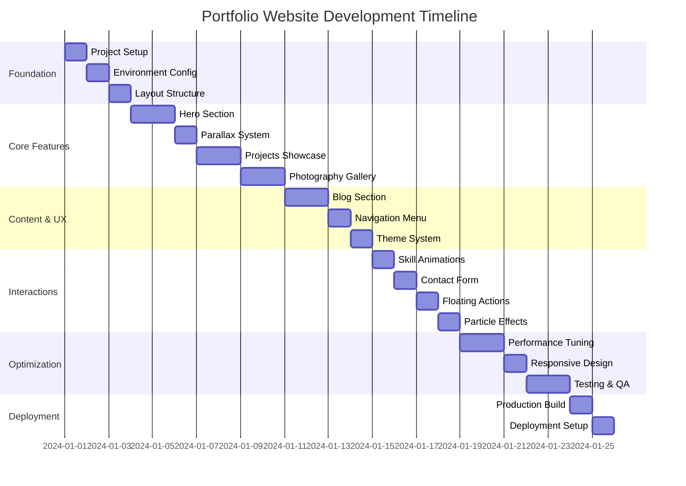
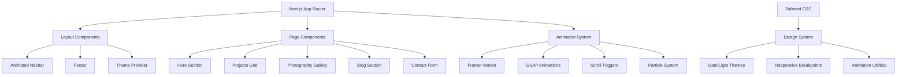
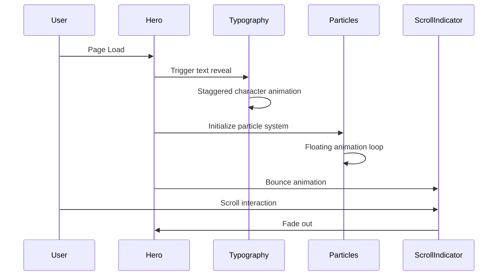
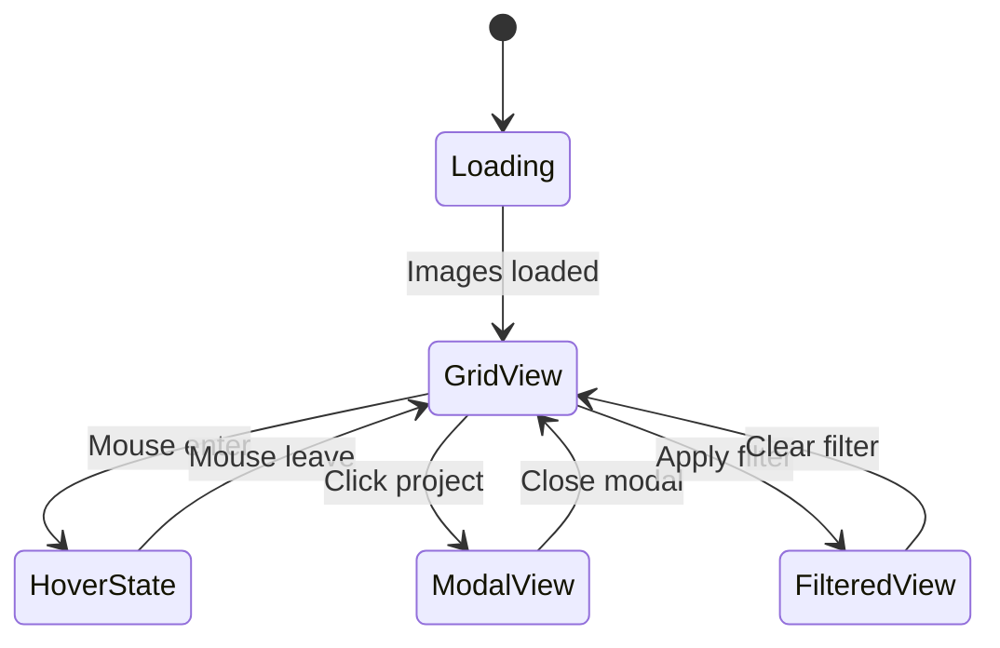
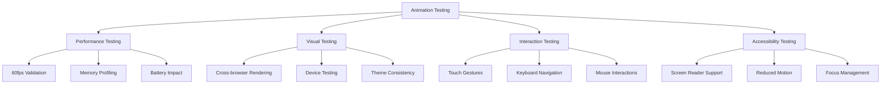

# Portfolio Website Development Roadmap

## 🎯 Project Vision

Create a visually stunning, highly interactive portfolio website that showcases projects, photography, and blog content with cutting-edge animations and modern web technologies.

## 📊 Development Timeline



## 🏗️ Architecture Overview



## 🎨 Feature Implementation Priority

### Phase 1: Foundation & Core (Days 1-3)

**Priority: Critical**

- [x] Project setup with Next.js 14 + TypeScript
- [x] Tailwind CSS configuration with custom animations
- [x] Framer Motion + GSAP integration
- [x] Basic layout structure and routing
- [x] Theme system with dark/light mode

**Deliverables:**

- Working development environment
- Basic page structure with navigation
- Theme toggle functionality
- Animation library setup

### Phase 2: Visual Impact (Days 4-6)

**Priority: High**

- [x] Animated hero section with dynamic typography
- [x] Particle background effects
- [x] Smooth parallax scrolling system
- [x] Projects showcase with hover animations
- [x] Photography masonry gallery

**Deliverables:**

- Stunning hero section with animations
- Interactive project grid
- Responsive photo gallery with lightbox
- Smooth scrolling experience

### Phase 3: Content & Interactions (Days 7-8)

**Priority: Medium-High**

- [x] Blog section with animated loading states
- [x] Reading progress indicators
- [x] Animated navigation menu
- [x] Interactive contact form
- [x] Skill bars and progress circles

**Deliverables:**

- Functional blog with animations
- Interactive contact form with validation
- Animated skill demonstrations
- Enhanced navigation experience

### Phase 4: Polish & Performance (Days 9-10)

**Priority: Medium**

- [x] Floating action buttons
- [x] Micro-interactions and hover effects
- [x] Performance optimization
- [x] Cross-browser testing
- [x] Mobile responsiveness

**Deliverables:**

- Polished micro-interactions
- Optimized performance (60fps)
- Cross-device compatibility
- Production-ready build

## 🎭 Animation Specifications

### Hero Section Animations



### Project Showcase Flow



## 📱 Responsive Design Strategy

### Breakpoint System

| Device  | Width       | Animations | Features                          |
| ------- | ----------- | ---------- | --------------------------------- |
| Mobile  | 320-768px   | Simplified | Touch gestures, reduced particles |
| Tablet  | 768-1024px  | Medium     | Touch + mouse, medium complexity  |
| Desktop | 1024-1440px | Full       | All animations, full feature set  |
| Large   | 1440px+     | Enhanced   | High-res assets, advanced effects |

### Animation Adaptations

- **Mobile**: Reduced motion, touch-friendly interactions
- **Tablet**: Balanced performance and visual impact
- **Desktop**: Full animation complexity
- **Large Screens**: Enhanced visual effects

## ⚡ Performance Targets

### Core Web Vitals

- **LCP (Largest Contentful Paint)**: < 2.5s
- **FID (First Input Delay)**: < 100ms
- **CLS (Cumulative Layout Shift)**: < 0.1

### Animation Performance

- **Frame Rate**: Consistent 60fps
- **Animation Duration**: Optimized for perceived performance
- **Memory Usage**: Efficient cleanup and disposal
- **Battery Impact**: Minimal on mobile devices

### Optimization Strategies

1. **Image Optimization**: WebP/AVIF formats, lazy loading
2. **Code Splitting**: Route-based and component-based
3. **Animation Optimization**: Transform/opacity only
4. **Bundle Size**: Tree shaking, dynamic imports

## 🧪 Testing Strategy

### Animation Testing



### Quality Assurance Checklist

- [ ] All animations run at 60fps
- [ ] Smooth scrolling on all devices
- [ ] Theme transitions work correctly
- [ ] Forms validate with animations
- [ ] Images load with proper placeholders
- [ ] Navigation is accessible
- [ ] Mobile gestures work properly
- [ ] Performance metrics meet targets

## 🚀 Deployment Strategy

### Build Optimization

```bash
# Production build with optimizations
npm run build

# Bundle analysis
npm run analyze

# Performance audit
npm run lighthouse
```

### Hosting Recommendations

1. **Vercel** (Recommended)

   - Optimal Next.js performance
   - Automatic deployments
   - Edge functions support
   - Built-in analytics

2. **Netlify**

   - Great for static sites
   - Form handling
   - Edge functions

3. **AWS Amplify**
   - Full-stack capabilities
   - Custom domains
   - CI/CD pipeline

### Post-Deployment Monitoring

- Performance monitoring with Web Vitals
- Error tracking with Sentry
- Analytics with Google Analytics 4
- User feedback collection

## 📋 Success Metrics

### Technical Metrics

- **Performance Score**: > 90 (Lighthouse)
- **Accessibility Score**: > 95 (Lighthouse)
- **SEO Score**: > 90 (Lighthouse)
- **Bundle Size**: < 500KB initial load

### User Experience Metrics

- **Bounce Rate**: < 40%
- **Session Duration**: > 2 minutes
- **Page Views per Session**: > 3
- **Mobile Usability**: 100% (Google)

### Animation Quality Metrics

- **Frame Rate**: Consistent 60fps
- **Animation Smoothness**: No jank or stuttering
- **Loading Animations**: Perceived performance improvement
- **Interaction Feedback**: Immediate visual response

## 🎯 Next Steps

The architectural planning phase is now complete! The comprehensive documentation includes:

1. **ARCHITECTURE.md** - Technical stack and system design
2. **COMPONENT_SPECIFICATIONS.md** - Detailed component animations
3. **IMPLEMENTATION_GUIDE.md** - Code patterns and configurations
4. **PROJECT_ROADMAP.md** - Development timeline and strategy

**Ready for Implementation Phase:**

- All technical decisions finalized
- Component specifications detailed
- Performance targets defined
- Development roadmap established

The foundation is set for creating a visually stunning, highly interactive portfolio website that will showcase your work with cutting-edge animations and modern web technologies.
